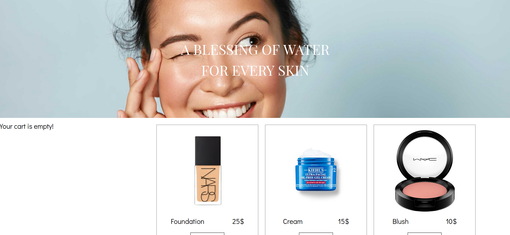
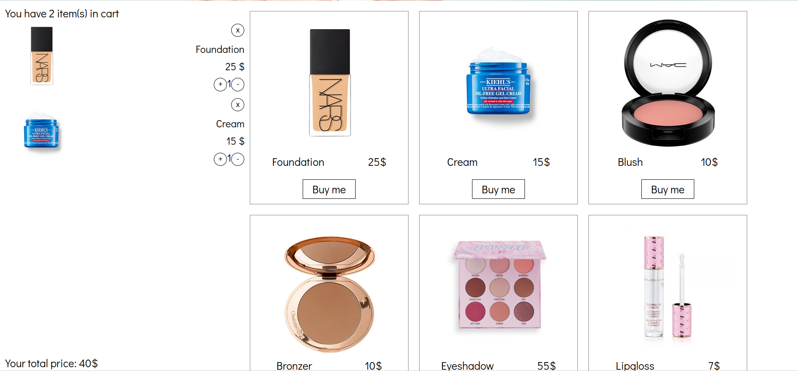

# Webshop with React

[**Try me on Netlify**](https://ana-webshop.netlify.app/)

---

## Getting started

**Technologies**

- Javascript
- React
- SCSS

**Requirements**

- Node.js 16.0.0+
- npm 7.10.0+

**First steps**

1. Clone this repository
2. Run `npm install`
3. Run `npm start`

## Scripts

### `npm run start`

Start the development environment.

### `npm run build`

Build the project for production.
